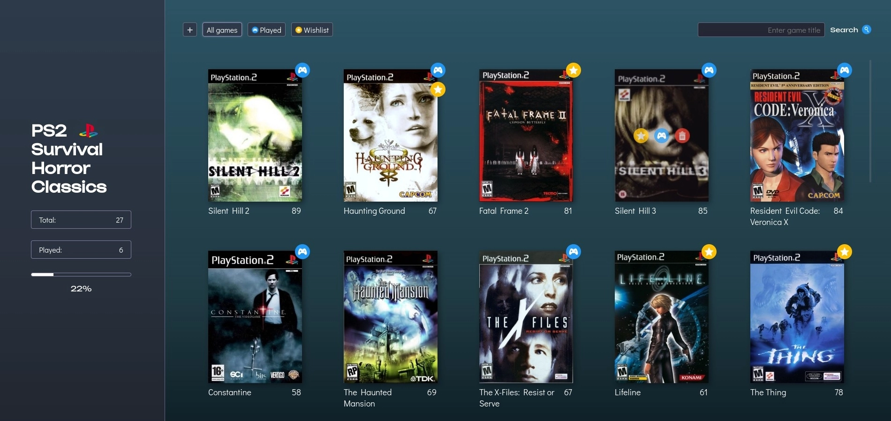
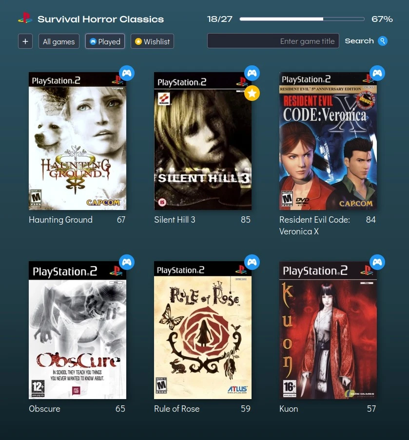
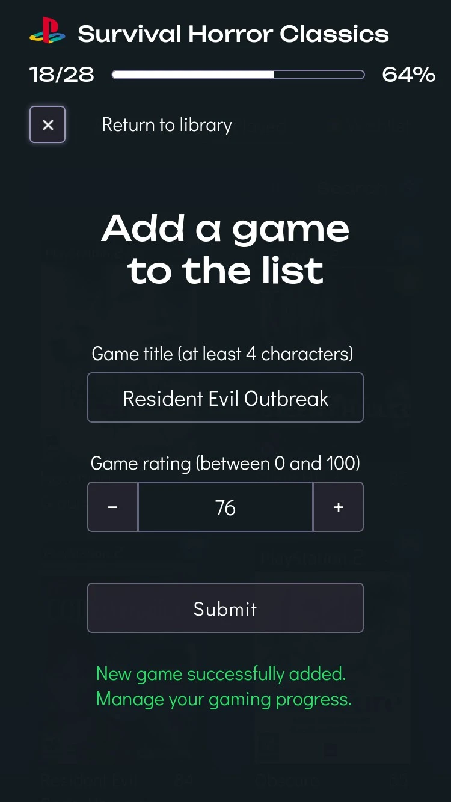

# PS2 Survival Horror Classics [](https://madebynomad.dev/ps2-horror)

This React Collector's App showcases a library of classic survival horror games for the PlayStation 2 (PS2). It allows users to keep track of their gaming progress, manage their collection & wishlist, and explore a curated list of iconic titles from the survival horror genre. The app provides interactive features for adding and deleting, review game details, add games to wishlist and/or mark them as played or collected.

Its component-based architecture serves to create modular, reusable, and self-contained UI elements. Each functional piece, from the navigation bar to individual game items, is encapsulated as a component, enabling easy maintenance and scalability. It involves dynamic rendering based on conditions, presenting users with relevant information and controls. Other dynamic data, such as play counts, search queries, and item states, are tracked and updated seamlessly to ensure real-time responsiveness. This reactive approach ensures that the UI remains in sync with the underlying data and minimizes unnecessary re-renders. 

Careful event handling enhances user engagement with UI updates and ensures consistent behavior across different user interactions. The semantic structure of the application and proper markup adheres to HTML5 and WCAG standards, promoting accessibility and providing search engine optimization. CSS classes are dynamically modified to reflect changes in the app's state. The app's visual design centers around simplicity, promoting effortless navigation and engagement. The minimalist approach helps to reduces clutter and distractions, allowing users to focus on essential information and interactions.

## v2.0 Showcase

https://github.com/vladnomad/ps2-horror/assets/98449247/3d4ffcda-30a0-4dd1-932e-decb732ede74

## What's New in v2.0

Integration with the IGDB API lets you explore each game's rich details and brings a substantial expansion of an initial game collection of PS2 horror games, presenting users with 88 titles, a threefold increase from v1.0. Plus, you can now add games to your library directly from the database. Furthermore, I have conducted a market research to provide pricing insights in three distinct categories (loose, CIB, and new copies). With an enhanced Welcome section to improve initial loading experience and an informative About section to clarify controls and pricing methodologies, the design and interactivity has been given a significant upgrade throughout the app. Wishlist is now back, alongside the Collection feature. Finally, you can get helpful insight into the current value of your collection or wishlist, based on the selected price options to plan your collector's journey and cherish the games you own.

## v1.0 Screenshots  


<p float="left">
    
    
</p>

## Getting Started
You can follow these steps to set up and run the app on your local machine.<br>
Make sure you have Node.js installed. You can download it from the [official website](https://nodejs.org).
```bash
# 1. Clone the Repository
git clone https://github.com/vladnomad/ps2-horror.git

# 2. Navigate to the Project Directory
cd ps2-horror

# 3. Install Project Dependencies
npm install

# 4. Start the Development Server
npm start
```

## Methodologies
- **Component Reusability**
- **Lifecycle Methods**
- **Regular & Derived State**
- **Session Storage**
- **Event Handling**
- **Conditional Rendering**
- **Dynamic Styling**

## Features

### v2.0 IGDB API
Explore an expanded collection of PS2 horror games integrated from the International Gaming Database (IGDB) API. Initial load presents users with 88 titles, a threefold increase from v1.0. Get detailed information about each game, including the full title, release date, game summary, developer, genres, links, cover art, background screenshots for Info, and age ratings. Even when information is not readily available, alternative data has been thoughtfully programmed to ensure a smooth user experience. The revamped AddGame feature now allows you to search for any PS2 title within the IGDB database, enabling you to select and add individual titles to your library while automatically preventing duplicate entries.

### v2.0 Pricing Insights
In-depth market research has led to the inclusion of comprehensive pricing information for each of the 88 games, categorized into three distinct tiers: loose, complete-in-box (CIB), and new. Each game now features a set of three buttons, each representing a different pricing category, complete with matching icons. Selecting a price category makes the game cover adopt a corresponding border — bronze, silver, or gold — reflecting its estimated value.

### v2.0 Collection and Wishlist Value
With the introduction of prices, I was able to provide users with the ability to track values of their collection and wishlist under respective filter options. Get a valuable insight into the total values, as well as, individual price tier values. The user can add Wishlist and Collection values separately, e.g adding a new copy of the game to the wishlist that is already in your collection as a loose or a CIB copy.

### v2.0 Welcome & About Section
Welcome section was introduced to enrich user experience while loading the initial data from the API seamlessly in the background. With the introduction of several new features, an About section was added to explain controls and provide insights into how pricing is handled. An improved design across the main section and controls, alongside enhanced interactivity and custom open/close animations for slide-in window toggle buttons. These enhancements ensure a more immersive and user-friendly experience throughout the app.

### Game List and Filtering
The game list showcases an array of PS2 survival horror titles, accompanied by pertinent metadata and icons denoting played and collected status. This carefully designed layout ensures that users can quickly scan through the list and identify relevant information. Users can selectively filter the list to display played games, collected items, or the entire library. This feature allows users to focus on specific subsets of the game library, enhancing usability for users with varied preferences.

### Intuitive Search Mechanism
The search bar enables users to search for specific games by title. The list dynamically updates to display matching results as users type, leveraging real-time feedback. This instant feedback enhances the search experience and helps users find games efficiently.

### Interactive Progress Tracking
A progress bar visually represents the percentage of games played / collected from the entire library depending on the filter selected. This interactive element intends to encourage engagement and exploration of the entire collection.

### Played and Collected Markers
Users have the ability to mark games as played or add them to their collection with intuitive buttons, providing a straightforward way to manage their collection, while icons are used to indicate changes.

### Streamlined Game Addition
The "Add Game" feature allows users to include new games in the library. Upon opening a menu with a form, the users are prompted to search PS2 database by entering the title and then choosing a game to add from the list. The form includes validation and error messages to ensure completeness and accuracy of the input and to prevent game duplication.

### UI/UX Integration
The user interface embodies an intuitive design, ensuring users promptly comprehend the functionality and purpose of each element. Clear labels, tooltips, and visual cues guide users through the app, minimizing the learning curve. Interactive elements, including buttons and icons, offer instant visual and tactile feedback upon engagement. This feedback enhances user confidence and responsiveness, contributing to a satisfying user experience. The app prioritizes seamless and responsive interactions, employing visual cues to highlight changes and status updates. Smooth transitions and animations ensure that users are informed about changes in the app's state, enhancing user engagement.

## Future Improvements
I am committed to improving the PS2 Survival Horror Classics Game Library App to provide an even better user experience. Here are some potential future enhancements I'm considering:

- [x] **Integration with IGDB API** <br> 
- [x] **Value Calculation** <br>
- [x] **Wishlist Filter** <br>
- [x] **Expanded Accessibility** <br>
- [x] **Landscape Styling on Mobile Devices** <br>
- [ ] **User Accounts and Syncing** <br>
Implementing user accounts will enable users to create profiles, save their progress, and synchronize their collections across different devices.
- [ ] **Sorting** <br>
This enhancement would help users to quickly identify and access games based on several sorting options like rating, name and release date.

## Acknowledgments
I extend my heartfelt gratitude to the developers of the iconic PS2 survival horror classics, whose dedication has left an indelible mark on the gaming world. Survival horror on the PS2 transcended mere entertainment, becoming an artistic expression that pushed the boundaries of storytelling, audiovisual design, and emotional engagement. The intricate environments, psychological tension, and spine-tingling soundscapes pushed players to the edge of their seats, delivering an adrenaline-fueled thrill like never before. The legacy of these classics endures as a testament to the power of interactive storytelling and the lasting impact that games can have on our lives.

## License
This project is licensed under the [GNU General Public License v3.0](LICENSE). It is a copyleft license that ensures the software remains open-source and freely available. It requires derivative works to be released under the same license and mandates source code availability. Any software that links to this code may also need to adhere to the GPL v3.0. Please review the LICENSE file for full details.
